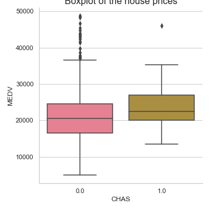
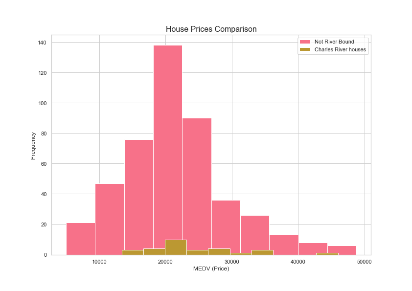

# Machine Learning Project
Machine Learning and statistics project 2019


1. Use **descriptive statistics** and plots to describe the Boston House Prices dataset.
2. Use **inferential statistics** to analyse whether there is a significant difference in median house prices between houses that are along the Charles river and those that aren’t. You should explain and discuss your findings within the notebook.
3. Use **keras to create a neural network** that can predict the median house price based on the other variables in the dataset.

### Quick Glance
I recommend using nbviewer to view this file:
https://nbviewer.jupyter.org/github/RitRa/MachineLearning-project/blob/master/Project.ipynb


This Project concerns Boston House Prices dataset and the Python packages [Scipy](https://www.scipy.org/), [Keras](https://keras.io/), and [Jupyter](https://jupyter.org/).

I recommend installing [jupyter](https://jupyter.org/) using the [anaconda](https://www.anaconda.com/) distribution to run this Project


Dataset used

#### importing the boston housing dataset

```
from sklearn.datasets import load_boston
boston_df = load_boston()
```

Libraries used in this Jupyter Notebook include:

- **[Pandas](https://pandas.pydata.org/)**: Pandas is an open source, BSD-licensed library providing high-performance, easy-to-use data structures and data analysis tools for the Python programming language. 

- **[NumPy](https://numpy.org/)**: NumPy is the fundamental package for scientific computing with Python. 

- **[Matplotlib](https://matplotlib.org/)**: Matplotlib is a Python 2D plotting library which produces publication quality figures in a variety of hardcopy formats and interactive environments across platforms. 

- **[Seaborn](https://seaborn.pydata.org/)**: Seaborn is a Python data visualization library based on matplotlib. It provides a high-level interface for drawing attractive and informative statistical graphics. 

- **[researchpy](https://researchpy.readthedocs.io/en/latest/index.html)**: produces Pandas DataFrames that contain relevant statistical testing information that is commonly required for academic research. 
```
conda install -c researchpy researchpy
```

- **[statsmodels](https://www.statsmodels.org/stable/index.html)**: is a Python module that provides classes and functions for the estimation of many different statistical models, as well as for conducting statistical tests, and statistical data exploration. 
```
conda install -c anaconda statsmodels
```
- **[Keras](https://keras.io/)** is a high-level neural networks API, written in Python and capable of running on top of [TensorFlow](https://www.tensorflow.org/), CNTK, or Theano.

```
conda install -c conda-forge keras
```

### import libraries

```
import numpy as np
import pandas as pd
import seaborn as sns
import matplotlib as plt
import researchpy as rp
import statsmodels.api as sm
```

### A Quick look at the data

|    |CRIM      |ZN      |INDUS |CHAS  |NOX  | RM    |AGE   | DIS   | RAD   | TAX	|PTRATIO|	B     |LSTAT|MEDV |
|----|----------|--------|------|------|-----|-------|------|-------|-------|-------|-------|---------|-----|-----|
|0	 |0.00632   |	18.0 |	2.31|	0.0|0.538|	6.575|	65.2|4.0900 |	1.0	|296.0  |	15.3|	396.90|	4.98| 24.0|
|1   |	0.02731 |	0.0  |	7.07|0.0   |0.469|	6.421|	78.9|4.9671 |	2.0	|242.0	|17.8   |396.90	  |9.14	| 21.6|
|2	 |0.02729   |	0.0	 |7.07  |	0.0|0.469|	7.185|	61.1|4.9671 |	2.0	|242.0  |	17.8|	392.83|	4.03| 34.7|
|3	 |0.03237	|0.0     |	2.18|	0.0|0.458|	6.998|	45.8|6.0622 |	3.0	|222.0  |	18.7|	394.63|	2.94| 33.4|
|4	 |0.06905   |	0.0	 |2.18  |	0.0|0.458|	7.147|	54.2|6.0622	|3.0    |222.0  |	18.7|	396.90|	5.33| 36.2|


### Descriptive statistics
describe() gives us a quick overview of the dataset

```
summary = boston.describe()
summary = summary.transpose()
summary.head(14)
```

|count |	mean	|std	|min	|25%	|50%|	75%|	max  |
|------|------------|-------|-------|-------|---|------|---------|
|CRIM|	506.0	|3.613524	|8.601545	|0.00632	|0.082045	|0.25651	|3.677083	|88.9762|
|ZN|	506.0	|11.363636|	23.322453|	0.00000	|0.000000	|0.00000	|12.500000	|100.0000|
|INDUS|	506.0|	11.136779	|6.860353	|0.46000	|5.190000|	9.69000|	18.100000	|27.7400|
|CHAS|	506.0	|0.069170	|0.253994|	0.00000	|0.000000|	0.00000|	0.000000|	1.0000|
|NOX	|506.0|	0.554695|	0.115878	|0.38500	|0.449000	|0.53800	|0.624000	|0.8710|
|RM|	506.0	|6.284634|	0.702617	|3.56100	|5.885500	|6.20850	|6.623500	|8.7800|
|AGE	|506.0|	68.574901	|28.148861	|2.90000	|45.025000	|77.50000	| 94.075000	|100.0000|
|DIS	|506.0|	3.795043	|2.105710	|1.12960|	2.100175|	3.20745|	5.188425	|12.1265|
|RAD|	506.0	|9.549407	|8.707259	|1.00000|	4.000000|	5.00000|	24.000000	|24.0000|
|TAX	|506.0	|408.237154	|168.537116|	187.00000	|279.000000	|330.00000	|666.000000|	711.0000|
|PTRATIO	|506.0|	18.455534|	2.164946|	12.60000|	17.400000|	19.05000|	20.200000|	22.0000|
|B|	506.0|	356.674032|	91.294864|	0.32000|	375.377500|	391.44000|	396.225000|	396.9000|
|LSTAT|	506.0|	12.653063	|7.141062|	1.73000|	6.950000|	11.36000|	16.955000|	37.9700|
|MEDV|	506.0|	22.532806	|9.197104|	5.00000|	17.025000|	21.20000|	25.000000|	50.0000|


*Add correlation plot here*


*add the linear regression plots here*


### Inferential statistics

Use inferential statistics to analyse whether there is a significant difference in median house prices between houses that are along the Charles river and those that aren’t. 

Visualise the spread of data 
*add box plots here of river vs non river*






#### Using a One-way Anova 

```
#oneway anova
import scipy.stats as stats
stats.f_oneway(other_df['MEDV'], riverhouse_df['MEDV'])
```

#### Z-test

Using a Z-test to compare the 2 means

```
# import the package for performing Z Test
from statsmodels.stats.weightstats import ztest

ztest(Y2,x2=None,value=Mean1)
```

Result: 
p value is 0.0014868133390002274 which is lower than 0.05 and therefore is statistically significant.
