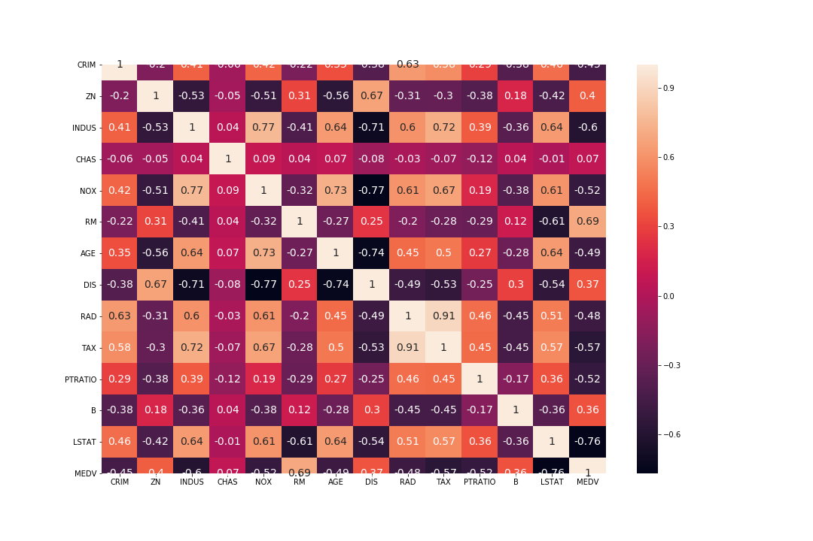
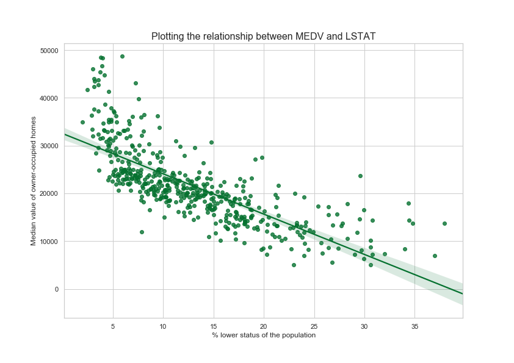

### Boston House Prices dataset, Neural Network
Machine Learning and statistics project 2019

The boston dataset was first published in 1978 in a paper [Hedonic Housing Prices and the Demand for Clean Air ](http://citeseerx.ist.psu.edu/viewdoc/download?doi=10.1.1.926.5532&rep=rep1&type=pdf) by Harrison and Rubenfield.  506 entries represent aggregated data about 14 features for homes in Boston and capture the Crime rate (CRIM), number of Rooms(RM), age(AGE) of owners and more. This dataset is widely used in many machine learning papers that address regression problems.

#### Aims of this notebook:

1. Use **descriptive statistics** and plots to describe the Boston House Prices dataset.
2. Use **inferential statistics** to analyse whether there is a significant difference in median house prices between houses that are along the Charles river and those that aren’t. You should explain and discuss your findings within the notebook.
3. Use **keras to create a neural network** that can predict the median house price based on the other variables in the dataset.

----------
#### Quick Glance
I recommend using nbviewer to view this file:
https://nbviewer.jupyter.org/github/RitRa/MachineLearning-project/blob/master/Machine%20Learning%20and%20Statistics%20Project%202019.ipynb


This Project concerns Boston House Prices dataset and the Python packages [Scipy](https://www.scipy.org/), [Keras](https://keras.io/), and [Jupyter](https://jupyter.org/).

I recommend installing [jupyter](https://jupyter.org/) using the [anaconda](https://www.anaconda.com/) distribution to run this Project


Dataset used

#### importing the boston housing dataset

```
from sklearn.datasets import load_boston
boston_df = load_boston()
```

Libraries used in this Jupyter Notebook include:

- **[Pandas](https://pandas.pydata.org/)**: Pandas is an open source, BSD-licensed library providing high-performance, easy-to-use data structures and data analysis tools for the Python programming language. 

- **[NumPy](https://numpy.org/)**: NumPy is the fundamental package for scientific computing with Python. 

- **[Matplotlib](https://matplotlib.org/)**: Matplotlib is a Python 2D plotting library which produces publication quality figures in a variety of hardcopy formats and interactive environments across platforms. 

- **[Seaborn](https://seaborn.pydata.org/)**: Seaborn is a Python data visualization library based on matplotlib. It provides a high-level interface for drawing attractive and informative statistical graphics. 

- **[researchpy](https://researchpy.readthedocs.io/en/latest/index.html)**: produces Pandas DataFrames that contain relevant statistical testing information that is commonly required for academic research. 
```
conda install -c researchpy researchpy
```

- **[statsmodels](https://www.statsmodels.org/stable/index.html)**: is a Python module that provides classes and functions for the estimation of many different statistical models, as well as for conducting statistical tests, and statistical data exploration. 
```
conda install -c anaconda statsmodels
```
- **[ipywidgets](https://ipywidgets.readthedocs.io/en/latest/)**
```
conda install -c conda-forge ipywidgets
```
- **[Keras](https://keras.io/)** is a high-level neural networks API, written in Python and capable of running on top of [TensorFlow](https://www.tensorflow.org/), CNTK, or Theano.

```
conda install -c conda-forge keras
```

### import libraries

```
import numpy as np
import pandas as pd
# charts
import seaborn as sns
import matplotlib.pyplot as plt
# for creating folder for plots
import os
# statistical analysis
import researchpy as rp
import statsmodels.api as sm
#for interactive widgets for charts
from ipywidgets import interact, interactive, fixed
import ipywidgets as widgets
# machine learning
from keras.models import Sequential
from keras.layers import Dense
```

### A Quick look at the data

|    |CRIM      |ZN      |INDUS |CHAS  |NOX  | RM    |AGE   | DIS   | RAD   | TAX	|PTRATIO|	B     |LSTAT|MEDV |
|----|----------|--------|------|------|-----|-------|------|-------|-------|-------|-------|---------|-----|-----|
|0	 |0.00632   |	18.0 |	2.31|	0.0|0.538|	6.575|	65.2|4.0900 |	1.0	|296.0  |	15.3|	396.90|	4.98| 24.0|
|1   |	0.02731 |	0.0  |	7.07|0.0   |0.469|	6.421|	78.9|4.9671 |	2.0	|242.0	|17.8   |396.90	  |9.14	| 21.6|
|2	 |0.02729   |	0.0	 |7.07  |	0.0|0.469|	7.185|	61.1|4.9671 |	2.0	|242.0  |	17.8|	392.83|	4.03| 34.7|
|3	 |0.03237	|0.0     |	2.18|	0.0|0.458|	6.998|	45.8|6.0622 |	3.0	|222.0  |	18.7|	394.63|	2.94| 33.4|
|4	 |0.06905   |	0.0	 |2.18  |	0.0|0.458|	7.147|	54.2|6.0622	|3.0    |222.0  |	18.7|	396.90|	5.33| 36.2|


### 1. Descriptive statistics
describe() gives us a quick overview of the dataset

```
summary = boston.describe()
summary = summary.transpose()
summary.head(14)
```

|count |	mean	|std	|min	|25%	|50%|	75%|	max  |
|------|------------|-------|-------|-------|---|------|---------|
|CRIM|	506.0	|3.613524	|8.601545	|0.00632	|0.082045	|0.25651	|3.677083	|88.9762|
|ZN|	506.0	|11.363636|	23.322453|	0.00000	|0.000000	|0.00000	|12.500000	|100.0000|
|INDUS|	506.0|	11.136779	|6.860353	|0.46000	|5.190000|	9.69000|	18.100000	|27.7400|
|CHAS|	506.0	|0.069170	|0.253994|	0.00000	|0.000000|	0.00000|	0.000000|	1.0000|
|NOX	|506.0|	0.554695|	0.115878	|0.38500	|0.449000	|0.53800	|0.624000	|0.8710|
|RM|	506.0	|6.284634|	0.702617	|3.56100	|5.885500	|6.20850	|6.623500	|8.7800|
|AGE	|506.0|	68.574901	|28.148861	|2.90000	|45.025000	|77.50000	| 94.075000	|100.0000|
|DIS	|506.0|	3.795043	|2.105710	|1.12960|	2.100175|	3.20745|	5.188425	|12.1265|
|RAD|	506.0	|9.549407	|8.707259	|1.00000|	4.000000|	5.00000|	24.000000	|24.0000|
|TAX	|506.0	|408.237154	|168.537116|	187.00000	|279.000000	|330.00000	|666.000000|	711.0000|
|PTRATIO	|506.0|	18.455534|	2.164946|	12.60000|	17.400000|	19.05000|	20.200000|	22.0000|
|B|	506.0|	356.674032|	91.294864|	0.32000|	375.377500|	391.44000|	396.225000|	396.9000|
|LSTAT|	506.0|	12.653063	|7.141062|	1.73000|	6.950000|	11.36000|	16.955000|	37.9700|
|MEDV|	506.0|	22.532806	|9.197104|	5.00000|	17.025000|	21.20000|	25.000000|	50.0000|


Let's look at the correlation between the variables in the dataset

- **Positive Correlation**: both variables change in the same direction (light color).

- **Neutral Correlation**: No relationship in the change of the variables.

- **Negative Correlation**: variables change in opposite directions (dark color).



From the correlation heatmap:

- We can see a positive correlation between MEDV and RM at 0.69. When the average number of rooms increase the price of the house also increases.
- Negative correlation between MEDV and LSTAT (% lower status of the population): -0.76
- Negative correlation between MEDV and PTRatio (pupil-teacher ratio by town): (-0.52)
- Negative correlation between MEDV and INDUS (proportion of non-retail business acres per town) (-0.6)

Let's plot these for more detail:




### 2. Inferential statistics

Use inferential statistics to analyse whether there is a significant difference in median house prices between houses that are along the Charles river and those that aren’t. 

Visualise the spread of data 
*add box plots here of river vs non river*


#### T-Test

Using a T-Test we can find out if there is a statistical significance between th two samples. I will use the researchpy library for this section.

```
descriptives, results = rp.ttest(other_df['MEDV'], riverhouse_df['MEDV'])

descriptives
```
|Variable	|N	      |Mean	  |SD	  |SE	  |95% Conf.	|Interval |
|-----------|---------|-------|-------|-------|-------------|---------|
MEDV	 |461.0	  |21488.503254|7898.848164|367.886036|	20765.557728|22211.448780
MEDV	|29.0|23979.310345	|7024.161328	|1304.354013	|21307.462269|26651.158421
combined|490.0|21635.918367|7865.301063|355.318083|20937.779775|22334.056960

This gives us a good overview of the the two samples. We can see that there is not a large different in the Means of each dataset and also the Standard deviations are similar.

|Independent |t-test	 |results
|---------|-------|-------|
0|Difference (MEDV - MEDV) =|	-2490.8071|
1	|Degrees of freedom =|	488.0000|
2	|t =	|-1.6571|
3	|Two side test p value =|	0.0981|
4	|Difference > 0 p value =|	0.0491|
5	|Difference < 0 p value =|	0.9509|
6	|Cohen's d =|	-0.3172|
7	|Hedge's g =|	-0.3168|
8	|Glass's delta =|	-0.3153|
9	|r =|	0.0748|

Results: According to the pvalue which is greater than 0.05, there is no stastistical significance. Prior to removing the duplicates, the results were showing a pvalue less than 0.05.

### 3. Predict

We will use keras to create a Neural network that can predict the median house price based on the other variables in the dataset. Neural networks are a set of algorithms, modeled loosely after the human brain, that are designed to recognize patterns.

```
import numpy as np
import pandas as pd
from keras.models import Sequential
from keras.layers import Dense
```

#### Selecting features
We will only take the variables that had a strong correlations with 'MEDV'. 'MEDV', will be the variable we seek to predict.

```
#features = boston.iloc[:,0:13]
features = boston[['RM', 'LSTAT', 'PTRATIO', 'INDUS']]

# target is the price, boston[['MEDV']]
prices = boston.iloc[:,13]
```

#### Normalising the data

A best practices are to normalise the data before added it to the Neural network to see better results.

```
from sklearn.preprocessing import MinMaxScaler

scaler = MinMaxScaler()

features= scaler.fit_transform(features)
prices= prices.values.reshape(-1,1)

prices = scaler.fit_transform(prices)
```


#### Create train and test split
Now we need to split the data into two subsets. Train will be used inside the neural network.

```
from sklearn.model_selection import train_test_split

# Shuffle and split the data into training and testing subsets
X_train, X_test, y_train, y_test = train_test_split(features, prices, test_size=0.20, random_state=50)

```

#### Create the model
With our training and test data set-up, we are now ready to build our model.

We create the model using 1 input layer, 2 hidden layers and 1 output layer.

As this a regression problem, the loss function we use is mean squared error and the metrics against which we evaluate the performance of the model is mean absolute error and accuracy. Also the output layer should be linear also.

```
from keras.callbacks import ModelCheckpoint
model = kr.models.Sequential()

n_cols = X_train.shape[1]
# The Input Layer, activation layer
model.add(kr.layers.Dense(128, kernel_initializer='normal',input_shape=(n_cols,), activation='relu'))
# The Hidden Layers :
#m.add(kr.layers.Dense(256, kernel_initializer='normal',activation='relu'))
model.add(kr.layers.Dense(256, kernel_initializer='normal',activation='relu'))
model.add(kr.layers.Dense(128, kernel_initializer='normal',activation='relu'))

# The Output Layer :
model.add(kr.layers.Dense(1, kernel_initializer='normal',activation='linear'))

print(model.summary())
```


#### Compile the Neural Network

model.compile(loss='mse', optimizer='adam', metrics=['mean_absolute_error', 'accuracy'])

#### Train the Model

```
from keras.callbacks import History 
history = History()
#  y_train = prices, use validation data 10%
hist = model.fit(X_train, y_train, validation_split=0.20, epochs=100, batch_size=6, callbacks=[history])
```
#### Plots


